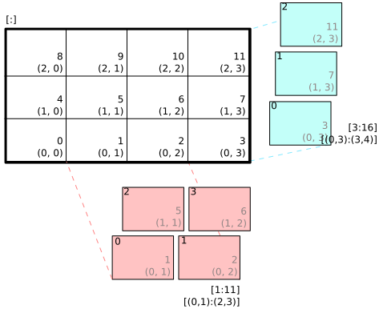
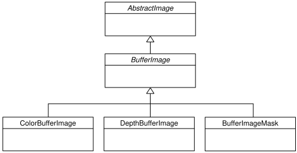

图像和精灵
==================

pyglet 提供了使用本机操作系统服务加载和保存各种格式的图像的功能。 如果安装了 `Pillow`_ 库，则可以支持许多其他格式。  
pyglet 还包括内置编解码器，用于在没有外部依赖项的情况下加载 PNG 和 BMP。

加载的图像可以有效地作为纹理提供给OpenGL，OpenGL纹理和帧缓冲区可以作为pyglet图像检索以进行保存或以其他方式操作。

如果你做过任何游戏或图形编程，你可能熟悉“精灵”的概念。 
pyglet 还提供了一个高效而全面的 :py:class:`~pyglet.sprite.Sprite` 类，用于在屏幕上显示带有可选变换（如缩放和旋转）的图像。
如果您打算对涉及在屏幕上移动和放置的图像执行任何操作，则可能需要使用精灵。

.. _Pillow: https://pillow.readthedocs.io

加载图像
-------

可以使用 :py:func:`pyglet.image.load` 函数加载图像::

    kitten = pyglet.image.load('kitten.png')

如果要分发包含映像的应用程序，请考虑使用 :py:mod:`pyglet.resource` 模块（请参阅 :ref:`guide_resources` ）。

在没有任何附加参数的情况下， :py:func:`pyglet.image.load` 将尝试加载使用任何可用的图像解码器指定的文件名。
这将允许您加载 PNG、GIF、JPEG、BMP 和 DDS 文件，以及可能的其他文件，具体取决于您的操作系统和其他已安装的模块（有关详细信息，请参阅下一节）。
如果无法加载图像，则会引发 :py:class:`~pyglet.image.codecs.ImageDecodeException` 。

您可以通过指定 `file` 关键字参数从提供 `read` 方法的任何类似文件的对象加载图像::

    kitten_stream = open('kitten.png', 'rb')
    kitten = pyglet.image.load('kitten.png', file=kitten_stream)

在这种情况下，文件名 ``kitten.png`` 是可选的，但会向解码器提供有关文件类型的提示（否则在提供文件对象时未使用）。

显示图像
-------

图像绘制通常在窗口的 :py:meth:`~pyglet.window.Window.on_draw` 事件处理程序中完成。
可以直接绘制单个图像，但通常您需要为屏幕上图像的每次外观创建一个“精灵”。

精灵
^^^^

精灵是一个功能齐全的类，用于在窗口中显示图像或动画的实例。
图像和动画实例主要关注图像数据（大小、像素等），而精灵还包括其他属性。
其中包括 x/y 位置、缩放、旋转、不透明度、色调、可见性以及水平和垂直缩放。
多个精灵可以共享同一图像，例如，数百个子弹精灵可能共享相同的子弹图像。

精灵是在给定图像或动画的情况下构建的，可以使用 :py:meth:`~pyglet.sprite.Sprite.draw` 方法直接绘制::

    sprite = pyglet.sprite.Sprite(img=image)

    @window.event
    def on_draw():
        window.clear()
        sprite.draw()

如果使用动画创建，则精灵会自动处理显示动画的最新帧。 以下示例使用定时函数在屏幕上逐渐移动精灵::

    def update(dt):
        # Move 10 pixels per second
        sprite.x += dt * 10

    # Call update 60 times a second
    pyglet.clock.schedule_interval(update, 1/60.)

如果您需要绘制许多精灵，强烈建议使用 :py:class:`~pyglet.graphics.Batch`一次绘制所有精灵。 
这比在循环中调用 :py:meth:`~pyglet.sprite.Sprite.draw` 要有效得多::

    batch = pyglet.graphics.Batch()

    sprites = [pyglet.sprite.Sprite(image, batch=batch),
               pyglet.sprite.Sprite(image, batch=batch),
               # ...  ]

    @window.event
    def on_draw():
        window.clear()
        batch.draw()

批处理绘制精灵时，不保证它们的绘制顺序。 
如果需要确保在绘制某些精灵之前绘制某些精灵（例如，横向图块可能绘制在角色精灵之前，而角色精灵可能在某些粒子效果精灵之前绘制），请使用两个或多个 :py:class:`~pyglet.graphics.OrderedGroup`对象来指定绘制顺序::

    batch = pyglet.graphics.Batch()
    background = pyglet.graphics.OrderedGroup(0)
    foreground = pyglet.graphics.OrderedGroup(1)

    sprites = [pyglet.sprite.Sprite(image, batch=batch, group=background),
               pyglet.sprite.Sprite(image, batch=batch, group=background),
               pyglet.sprite.Sprite(image, batch=batch, group=foreground),
               pyglet.sprite.Sprite(image, batch=batch, group=foreground),
               # ...]

    @window.event
    def on_draw():
        window.clear()
        batch.draw()

为了获得最佳性能，应根据需要使用尽可能少的批次和组。
（有关批处理和组渲染的更多详细信息，请参阅 :ref:`guide_graphics` 部分）。这将减少绘制每个帧的内部和 OpenGL 操作的数量。

此外，尝试将您的图像组合成尽可能少的纹理，例如，通过使用 :py:func:`pyglet.resource.image` （参见 :ref:`guide_resources` ）或 :ref:`guide_texture-bins-and-atlases` 加载图像。
一个常见的陷阱是使用 :py:func:`pyglet.image.load` 方法来加载大量图像。 
这将导致为每个加载的图像创建单独的纹理，从而导致每个帧的大量 OpenGL 纹理绑定开销。

简单的图像块传输
^^^^^^^^^^^^^^^

直接绘制图像效率较低，但对于简单情况可能足够。图像可以使用 :py:meth:`~pyglet.image.AbstractImage.blit` 方法绘制到窗口中::

    @window.event
    def on_draw():
        window.clear()
        image.blit(x, y)

`x` 和 `y` 坐标用于定位绘制图像锚点的位置。 例如，将图像居中置于 ``(x, y)``::

    kitten.anchor_x = kitten.width // 2
    kitten.anchor_y = kitten.height // 2
    kitten.blit(x, y)

您还可以为 :py:meth:`~pyglet.image.AbstractImage.blit` 方法指定可选的 `z` 组件。
除非您更改了默认投影或启用了深度测试，否则此操作不起作用。 在下面的示例中，第二个图像绘制在第一个图像后面，即使它是在它之后绘制的::

    from pyglet.gl import *
    glEnable(GL_DEPTH_TEST)

    kitten.blit(x, y, 0)
    kitten.blit(x, y, -0.5)

默认 pyglet 投影的深度范围为 (-1, 1) ——无论是否启用深度测试，使用 z 值超出此范围绘制的图像都将不可见。

具有 Alpha 通道的图像可以与现有帧缓冲混合。 
为此，您需要为 OpenGL 提供一个混合方程。 
以下代码片段实现了最常见的 alpha 混合形式，但也可以使用其他技术::

    from pyglet.gl import *
    glEnable(GL_BLEND)
    glBlendFunc(GL_SRC_ALPHA, GL_ONE_MINUS_SRC_ALPHA)

在绘制任何图像之前，您只需在程序期间调用上述代码一次（仅使用精灵时不需要这样做）。

支持的图像解码器
---------------
下表显示了 pyglet 中可用的编解码器。

    .. list-table::
        :header-rows: 1

        * - Module
          - Class
          - Description
        * - ``pyglet.image.codecs.dds``
          - ``DDSImageDecoder``
          - Reads Microsoft DirectDraw Surface files containing compressed
            textures
        * - ``pyglet.image.codecs.wic``
          - ``WICDecoder``
          - Uses Windows Imaging Component services to decode images.
        * - ``pyglet.image.codecs.gdiplus``
          - ``GDIPlusDecoder``
          - Uses Windows GDI+ services to decode images.
        * - ``pyglet.image.codecs.gdkpixbuf2``
          - ``GdkPixbuf2ImageDecoder``
          - Uses the GTK-2.0 GDK functions to decode images.
        * - ``pyglet.image.codecs.pil``
          - ``PILImageDecoder``
          - Wrapper interface around PIL Image class.
        * - ``pyglet.image.codecs.quicktime``
          - ``QuickTimeImageDecoder``
          - Uses Mac OS X QuickTime to decode images.
        * - ``pyglet.image.codecs.png``
          - ``PNGImageDecoder``
          - PNG decoder written in pure Python.
        * - ``pyglet.image.codecs.bmp``
          - ``BMPImageDecoder``
          - BMP decoder written in pure Python.

这些类中的每一个都使用 :py:mod:`pyglet.image` 注册自己，并带有它支持的文件扩展名。 
:py:func:`~pyglet.image.load` 函数将首先尝试具有匹配文件扩展名的每个图像解码器，然后再尝试其他解码器。 
仅当每个图像解码器都无法加载图像时，才会 :py:class:`~pyglet.image.codecs.ImageDecodeException`（异常的来源将是尝试的第一个解码器）。

您可以覆盖此行为并指定要使用的特定解码实例。 例如，在下面的示例中，始终使用纯 Python PNG 解码器，而不是操作系统的解码器::

    from pyglet.image.codecs.png import PNGImageDecoder
    kitten = pyglet.image.load('kitten.png', decoder=PNGImageDecoder())

除非应用程序必须解决操作系统解码器中的特定缺陷，否则不建议使用此用法。

支持的图像格式
-------------

下表列出了可以在每个操作系统上加载的映像格式。 如果安装了 Pillow，也可以读取它支持的任何其他格式。 有关此类格式的列表，请参阅  `Pillow docs`_ 。

.. _Pillow docs: http://pillow.readthedocs.io/

    .. list-table::
        :header-rows: 1

        * - Extension
          - Description
          - Windows
          - Mac OS X
          - Linux [#linux]_
        * - ``.bmp``
          - Windows Bitmap
          - X
          - X
          - X
        * - ``.dds``
          - Microsoft DirectDraw Surface [#dds]_
          - X
          - X
          - X
        * - ``.exif``
          - Exif
          - X
          -
          -
        * - ``.gif``
          - Graphics Interchange Format
          - X
          - X
          - X
        * - ``.jpg .jpeg``
          - JPEG/JIFF Image
          - X
          - X
          - X
        * - ``.jp2 .jpx``
          - JPEG 2000
          -
          - X
          -
        * - ``.pcx``
          - PC Paintbrush Bitmap Graphic
          -
          - X
          -
        * - ``.png``
          - Portable Network Graphic
          - X
          - X
          - X
        * - ``.pnm``
          - PBM Portable Any Map Graphic Bitmap
          -
          -
          - X
        * - ``.ras``
          - Sun raster graphic
          -
          -
          - X
        * - ``.tga``
          - Truevision Targa Graphic
          -
          - X
          -
        * - ``.tif .tiff``
          - Tagged Image File Format
          - X
          - X
          - X
        * - ``.xbm``
          - X11 bitmap
          -
          - X
          - X
        * - ``.xpm``
          - X11 icon
          -
          - X
          - X

唯一支持的保存格式是 PNG，除非安装了 PIL，在这种情况下，可以写入它支持的任何格式。

.. [#linux] 需要 GTK 2.0 或更高版本。

.. [#dds] 仅支持 S3TC 压缩曲面。 不支持深度、体积和立方体纹理。

使用图像
-------

:py:func:`pyglet.image.load` 函数返回一个 :py:class:`~pyglet.image.AbstractImage` 。
对象的实际类取决于所使用的解码器，但所有加载的图像都具有以下属性：

`width` 
    图像的宽度（以像素为单位）。
`height`
    图像的高度（以像素为单位）。
`anchor_x`
    锚点与图像左边缘的距离（以像素为单位）。
`anchor_y`
    锚点与图像底部边缘的距离（以像素为单位）。

锚点默认为 (0, 0)，但某些图像格式可能包含固有锚点。 锚点用于在绘制图像时将图像与空间中的点对齐。

您可能只想使用完整图像的一部分。 可以使用 :py:meth:`~pyglet.image.AbstractImage.get_region`方法返回源图像的矩形区域的图像::

    image_part = kitten.get_region(x=10, y=10, width=100, height=100)

这将返回尺寸为 100x100 的图像。 从 `kitten` 中提取的区域对齐，使矩形的左下角距离图像左侧 10 像素，距离图像底部 10 像素。

图像区域可以像使用完整图像一样使用。 
请注意，对图像区域的更改可能会也可能不会反映在源图像上，对源图像的更改可能会也可能不会反映在任何区域图像上。
您不应该假设这两种行为。

抽象图像层次结构
---------------

以下各节介绍各种具体的图像类。 所有图像子类 :py:class:`~pyglet.image.AbstractImage`，它提供了前面几节中描述的基本接口。

.. figure:: img/abstract_image.png

    :py:class:`~pyglet.image.AbstractImage` 类层次结构。

任何类的图像都可以使用 :py:class:`~pyglet.image.AbstractImage` 上定义的 :py:meth:`~pyglet.image.AbstractImage.get_texture` 和 :py:meth:`~pyglet.image.ImageData.get_image_data` 方法转换为 :py:class:`~pyglet.image.Texture` 或 :py:class:`~pyglet.image.ImageData` 。 
例如，加载图像并将其用作 OpenGL 纹理::

    kitten = pyglet.image.load('kitten.png').get_texture()

如果对象已经属于请求的类，则访问这些方法之一不会受到任何惩罚。 
下表显示了如何将具体类转换为其他类：

    .. list-table::
        :header-rows: 1
        :stub-columns: 1

        * - Original class
          - ``.get_texture()``
          - ``.get_image_data()``
        * - :py:class:`~pyglet.image.Texture`
          - No change
          - ``glGetTexImage2D``
        * - :py:class:`~pyglet.image.TextureRegion`
          - No change
          - ``glGetTexImage2D``, crop resulting image.
        * - :py:class:`~pyglet.image.ImageData`
          - ``glTexImage2D`` [1]_
          - No change
        * - :py:class:`~pyglet.image.ImageDataRegion`
          - ``glTexImage2D`` [1]_
          - No change
        * - :py:class:`~pyglet.image.CompressedImageData`
          - ``glCompressedTexImage2D`` [2]_
          - N/A [3]_
        * - :py:class:`~pyglet.image.BufferImage`
          - ``glCopyTexSubImage2D`` [4]_
          - ``glReadPixels``

您应该尽量避免使用 ``glGetTexImage2D``或 ``glReadPixels`` 的转换，因为这些转换可能会在视频总线的“错误”方向上传输数据，尤其是在较旧的硬件上，从而造成严重的性能损失。

.. [1]  :py:class:`~pyglet.image.ImageData` 缓存纹理以供将来使用，因此重复传送 :py:class:`~pyglet.image.ImageData` 不会对性能造成损失。

.. [2]  如果所需的纹理压缩扩展不存在，则图像将在内存中解压缩，然后通过 ``glTexImage2D`` 提供给OpenGL。

.. [3]  目前无法检索压缩纹理图像的 :py:class:`~pyglet.image.ImageData` 。 
        此功能可能会在 pyglet 的未来版本中实现。 一种解决方法是从压缩图像创建纹理，然后从纹理中读取图像数据，比如 ``compressed_image.get_texture().get_image_data()`` 。

.. [4]  :py:class:`~pyglet.image.BufferImageMask` 无法转换为 :py:class:`~pyglet.image.Texture`。

访问或提供像素数据
-----------------

:py:class:`~pyglet.image.ImageData` 类将图像表示为像素数据的字符串或序列，或 ctypes 指针。 
跨度和组件布局等详细信息也存储在类中。 
您可以访问任何具有 :py:meth:`~pyglet.image.ImageData.get_image_data` 的图像的 :py:class:`~pyglet.image.ImageData` 对象

    kitten = pyglet.image.load('kitten.png').get_image_data()

:py:class:`~pyglet.image.ImageData` 的设计是允许应用程序以他们喜欢的格式，而不必理解每个操作系统和OpenGL使用的多种格式。

`pitch` 和 `format` 属性决定了字节的排列方式。
`pitch` 给出每个连续行之间的字节数。 假设数据从左到右，从下到上运行，除非 `pitch` 为负数，在这种情况下，它从左到右，从上到下运行。 
无需将行紧密包装，较大的 `pitch` 值通常用于将每行与机器单词边界对齐。

`format` 属性给出颜色分量的数量和顺序。 它是与下表中的组件对应的一个或多个字母的字符串:

    = ============
    R Red
    G Green
    B Blue
    A Alpha
    L Luminance
    I Intensity
    = ============

例如， ``"RGBA"`` 的格式字符串对应于四个字节的颜色数据，顺序为红色、绿色、蓝色、字母。 请注意，计算机字节序对格式字符串的解释没有影响。

格式字符串的长度始终提供每个像素的字节数。 因此，给定图像的最小绝对间距为 ``len(kitten.format) * kitten.width`` 。

要检索特定格式的像素数据，请使用 `get_data` 方法，指定所需的格式和间距。下面的示例读取 ``RGB`` 格式的紧密打包行（alpha 组件（如果有）将被丢弃）::

    kitten = kitten.get_image_data()
    data = kitten.get_data('RGB', kitten.width * 3)

`data` 始终返回一个字符串，但是可以从ctypes数组，stdlib数组，字节数据列表，字符串或ctypes指针中设置像素数据。
要设置图像数据，请使用 `set_data` ，再次指定格式和跨度::

    kitten.set_data('RGB', kitten.width * 3, data)

您还可以直接创建 :py:class:`~pyglet.image.ImageData` ，方法是向构造函数提供这些属性中的每一个。这是从其他程序或库将纹理加载到 OpenGL 中的任何简单方法。

性能问题
^^^^^^^^

Pyglet 可以使用多种方法将像素数据从一种格式转换为另一种格式。 它将始终尝试选择最有效的方法。 
例如，在向OpenGL提供纹理数据时，将按顺序检查以下可能性：

1. 是否可以使用内置的OpenGL像素格式（如 ``GL_RGB`` 或 ``GL_RGBA``）直接提供数据？
2. 是否存在处理此像素格式的扩展？
3. 数据可以用单个正则表达式转换吗？
4. 如果以上都不可能，图像将被拆分为单独的扫描线，并在每条扫描线上进行正则表达式替换;然后这些线将再次连接在一起。

The following table shows which image formats can be used directly with steps
1 and 2 above, as long as the image rows are tightly packed (that is, the
pitch is equal to the width times the number of components).

    .. list-table::
        :header-rows: 1

        * - Format
          - Required extensions
        * - ``"I"``
          -
        * - ``"L"``
          -
        * - ``"LA"``
          -
        * - ``"R"``
          -
        * - ``"G"``
          -
        * - ``"B"``
          -
        * - ``"A"``
          -
        * - ``"RGB"``
          -
        * - ``"RGBA"``
          -
        * - ``"ARGB"``
          - ``GL_EXT_bgra`` and ``GL_APPLE_packed_pixels``
        * - ``"ABGR"``
          - ``GL_EXT_abgr``
        * - ``"BGR"``
          - ``GL_EXT_bgra``
        * - ``"BGRA"``
          - ``GL_EXT_bgra``

If the image data is not in one of these formats, a regular expression will be
constructed to pull it into one.  If the rows are not tightly packed, or if
the image is ordered from top-to-bottom, the rows will be split before the
regular expression is applied.  Each of these may incur a performance penalty
-- you should avoid such formats for real-time texture updates if possible.

Image sequences and atlases
---------------------------

Sometimes a single image is used to hold several images.  For example, a
"sprite sheet" is an image that contains each animation frame required for a
character sprite animation.

pyglet provides convenience classes for extracting the individual images from
such a composite image as if it were a simple Python sequence.  Discrete
images can also be packed into one or more larger textures with texture bins
and atlases.

.. figure:: img/image_sequence.png

    The AbstractImageSequence class hierarchy.

Image grids
^^^^^^^^^^^

An "image grid" is a single image which is divided into several smaller images
by drawing an imaginary grid over it.  The following image shows an image used
for the explosion animation in the *Astraea* example.

.. figure:: img/explosion.png

    An image consisting of eight animation frames arranged in a grid.

This image has one row and eight columns.  This is all the information you
need to create an :py:class:`~pyglet.image.ImageGrid` with::

    explosion = pyglet.image.load('explosion.png')
    explosion_seq = pyglet.image.ImageGrid(explosion, 1, 8)

The images within the grid can now be accessed as if they were their own
images::

    frame_1 = explosion_seq[0]
    frame_2 = explosion_seq[1]

Images with more than one row can be accessed either as a single-dimensional
sequence, or as a (row, column) tuple; as shown in the following diagram.

    An image grid with several rows and columns, and the slices that can be
    used to access it.

Image sequences can be sliced like any other sequence in Python.  For example,
the following obtains the first four frames in the animation::

    start_frames = explosion_seq[:4]

For efficient rendering, you should use a
:py:class:`~pyglet.image.TextureGrid`.
This uses a single texture for the grid, and each individual image returned
from a slice will be a :py:class:`~pyglet.image.TextureRegion`::

    explosion_tex_seq = image.TextureGrid(explosion_seq)

Because :py:class:`~pyglet.image.TextureGrid` is also a
:py:class:`~pyglet.image.Texture`, you can use it either as individual images
or as the whole grid at once.

3D textures
^^^^^^^^^^^

:py:class:`~pyglet.image.TextureGrid` is extremely efficient for drawing many
sprites from a single texture.  One problem you may encounter, however,
is bleeding between adjacent images.

When OpenGL renders a texture to the screen, by default it obtains each pixel
colour by interpolating nearby texels.  You can disable this behaviour by
switching to the ``GL_NEAREST`` interpolation mode, however you then lose the
benefits of smooth scaling, distortion, rotation and sub-pixel positioning.

You can alleviate the problem by always leaving a 1-pixel clear border around
each image frame.  This will not solve the problem if you are using
mipmapping, however.  At this stage you will need a 3D texture.

You can create a 3D texture from any sequence of images, or from an
:py:class:`~pyglet.image.ImageGrid`.  The images must all be of the same
dimension, however they need not be powers of two (pyglet takes care of
this by returning :py:class:`~pyglet.image.TextureRegion`
as with a regular :py:class:`~pyglet.image.Texture`).

In the following example, the explosion texture from above is uploaded into a
3D texture::

    explosion_3d = pyglet.image.Texture3D.create_for_image_grid(explosion_seq)

You could also have stored each image as a separate file and used
:py:meth:`pyglet.image.Texture3D.create_for_images` to create the 3D texture.

Once created, a 3D texture behaves like any other
:py:class:`~pyglet.image.AbstractImageSequence`; slices return
:py:class:`~pyglet.image.TextureRegion` for an image plane within the texture.
Unlike a :py:class:`~pyglet.image.TextureGrid`, though, you cannot blit a
:py:class:`~pyglet.image.Texture3D` in its entirety.

.. _guide_texture-bins-and-atlases:

Texture bins and atlases
^^^^^^^^^^^^^^^^^^^^^^^^

Image grids are useful when the artist has good tools to construct the larger
images of the appropriate format, and the contained images all have the same
size.  However it is often simpler to keep individual images as separate files
on disk, and only combine them into larger textures at runtime for efficiency.

A :py:class:`~pyglet.image.atlas.TextureAtlas` is initially an empty texture,
but images of any size can be added to it at any time.  The atlas takes care
of tracking the "free" areas within the texture, and of placing images at
appropriate locations within the texture to avoid overlap.

It's possible for a :py:class:`~pyglet.image.atlas.TextureAtlas` to run out
of space for new images, so applications will need to either know the correct
size of the texture to allocate initally, or maintain multiple atlases as
each one fills up.

The :py:class:`~pyglet.image.atlas.TextureBin` class provides a simple means
to manage multiple atlases. The following example loads a list of images,
then inserts those images into a texture bin.  The resulting list is a list of
:py:class:`~pyglet.image.TextureRegion` images that map
into the larger shared texture atlases::

    images = [
        pyglet.image.load('img1.png'),
        pyglet.image.load('img2.png'),
        # ...
    ]

    bin = pyglet.image.atlas.TextureBin()
    images = [bin.add(image) for image in images]

The :py:mod:`pyglet.resource` module (see :ref:`guide_resources`) uses
texture bins internally to efficiently pack images automatically.

Animations
----------

While image sequences and atlases provide storage for related images,
they alone are not enough to describe a complete animation.

The :py:class:`~pyglet.image.Animation` class manages a list of
:py:class:`~pyglet.image.AnimationFrame` objects, each of
which references an image and a duration (in seconds).  The storage of
the images is up to the application developer: they can each be discrete, or
packed into a texture atlas, or any other technique.

An animation can be loaded directly from a GIF 89a image file with
:py:func:`~pyglet.image.load_animation` (supported on Linux, Mac OS X
and Windows) or constructed manually from a list of images or an image
sequence using the class methods (in which case the timing information
will also need to be provided).
The :py:func:`~pyglet.image.Animation.add_to_texture_bin` method provides
a convenient way to pack the image frames into a texture bin for efficient
access.

Individual frames can be accessed by the application for use with any kind of
rendering, or the entire animation can be used directly with a
:py:class:`~pyglet.sprite.Sprite` (see next section).

The following example loads a GIF animation and packs the images in that
animation into a texture bin.  A sprite is used to display the animation in
the window::

    animation = pyglet.image.load_animation('animation.gif')
    bin = pyglet.image.atlas.TextureBin()
    animation.add_to_texture_bin(bin)
    sprite = pyglet.sprite.Sprite(img=animation)

    window = pyglet.window.Window()

    @window.event
    def on_draw():
        window.clear()
        sprite.draw()

    pyglet.app.run()

When animations are loaded with :py:mod:`pyglet.resource` (see
:ref:`guide_resources`) the frames are automatically packed into a texture bin.

This example program is located in
`examples/programming_guide/animation.py`, along with a sample GIF animation
file.

Buffer images
-------------

pyglet provides a basic representation of the framebuffer as components of the
:py:class:`~pyglet.image.AbstractImage` hierarchy.  At this stage this
representation is based off OpenGL 1.1, and there is no support for newer
features such as framebuffer objects.  Of course, this doesn't prevent you
using framebuffer objects in your programs -- :py:mod:`pyglet.gl` provides
this functionality -- just that they are not represented as
:py:class:`~pyglet.image.AbstractImage` types.

    The :py:class:`~pyglet.image.BufferImage` hierarchy.

A framebuffer consists of

* One or more colour buffers, represented by
  :py:class:`~pyglet.image.ColorBufferImage`
* An optional depth buffer, represented by
  :py:class:`~pyglet.image.DepthBufferImage`
* An optional stencil buffer, with each bit represented by
  :py:class:`~pyglet.image.BufferImageMask`
* Any number of auxiliary buffers, also represented by
  :py:class:`~pyglet.image.ColorBufferImage`

You cannot create the buffer images directly; instead you must obtain
instances via the :py:class:`~pyglet.image.BufferManager`.
Use :py:func:`~pyglet.image.get_buffer_manager` to get this singleton::

    buffers = image.get_buffer_manager()

Only the back-left color buffer can be obtained (i.e., the front buffer is
inaccessible, and stereo contexts are not supported by the buffer manager)::

    color_buffer = buffers.get_color_buffer()

This buffer can be treated like any other image.  For example, you could copy
it to a texture, obtain its pixel data, save it to a file, and so on.  Using
the :py:attr:`~pyglet.image.AbstractImage.texture` attribute is particularly
useful, as it allows you to perform multipass rendering effects without
needing a render-to-texture extension.

The depth buffer can be obtained similarly::

    depth_buffer = buffers.get_depth_buffer()

When a depth buffer is converted to a texture, the class used will be a
:py:class:`~pyglet.image.DepthTexture`, suitable for use with shadow map
techniques.

The auxiliary buffers and stencil bits are obtained by requesting one, which
will then be marked as "in-use".  This permits multiple libraries and your
application to work together without clashes in stencil bits or auxiliary
buffer names.  For example, to obtain a free stencil bit::

    mask = buffers.get_buffer_mask()

The buffer manager maintains a weak reference to the buffer mask, so that when
you release all references to it, it will be returned to the pool of available
masks.

Similarly, a free auxiliary buffer is obtained::

    aux_buffer = buffers.get_aux_buffer()

When using the stencil or auxiliary buffers, make sure you explicitly request
these when creating the window.  See `OpenGL configuration options` for
details.

OpenGL imaging
--------------

This section assumes you are familiar with texture mapping in OpenGL (for
example, chapter 9 of the `OpenGL Programming Guide`_).

To create a texture from any :py:class:`~pyglet.image.AbstractImage`,
call :py:meth:`~pyglet.image.AbstractImage.get_texture`::

    kitten = image.load('kitten.jpg')
    texture = kitten.get_texture()

Textures are automatically created and used by
:py:class:`~pyglet.image.ImageData` when blitted.  Itis useful to use
textures directly when aiming for high performance or 3D applications.

The :py:class:`~pyglet.image.Texture` class represents any texture object.
The :py:attr:`~pyglet.image.TextureRegion.target` attribute gives the
texture target (for example, ``GL_TEXTURE_2D``) and
:py:attr:`~pyglet.image.TextureRegion.id` the texturename.
For example, to bind a texture::

    glBindTexture(texture.target, texture.id)

Texture dimensions
^^^^^^^^^^^^^^^^^^

Implementations of OpenGL prior to 2.0 require textures to have dimensions
that are powers of two (i.e., 1, 2, 4, 8, 16, ...).  Because of this
restriction, pyglet will always create textures of these dimensions (there are
several non-conformant post-2.0 implementations).  This could have unexpected
results for a user blitting a texture loaded from a file of non-standard
dimensions.  To remedy this, pyglet returns a
:py:class:`~pyglet.image.TextureRegion` of the larger
texture corresponding to just the part of the texture covered by the original
image.

A :py:class:`~pyglet.image.TextureRegion` has an `owner` attribute that
references the larger texture. The following session demonstrates this::

    >>> rgba = image.load('tests/image/rgba.png')
    >>> rgba
    <ImageData 235x257>         # The image is 235x257
    >>> rgba.get_texture()
    <TextureRegion 235x257>     # The returned texture is a region
    >>> rgba.get_texture().owner
    <Texture 256x512>           # The owning texture has power-2 dimensions
    >>>

A :py:class:`~pyglet.image.TextureRegion` defines a
:py:attr:`~pyglet.image.TextureRegion.tex_coords` attribute that gives
the texture coordinates to use for a quad mapping the whole image.
:py:attr:`~pyglet.image.TextureRegion.tex_coords` is a 4-tuple of 3-tuple
of floats; i.e., each texture coordinate is given in 3 dimensions.
The following code can be used to render a quad for a texture region::

    texture = kitten.get_texture()
    t = texture.tex_coords
    w, h = texture.width, texture.height
    array = (GLfloat * 32)(
         t[0][0], t[0][1], t[0][2], 1.,
         x,       y,       z,       1.,
         t[1][0], t[1][1], t[1][2], 1.,
         x + w,   y,       z,       1.,
         t[2][0], t[2][1], t[2][2], 1.,
         x + w,   y + h,   z,       1.,
         t[3][0], t[3][1], t[3][2], 1.,
         x,       y + h,   z,       1.)

    glPushClientAttrib(GL_CLIENT_VERTEX_ARRAY_BIT)
    glInterleavedArrays(GL_T4F_V4F, 0, array)
    glDrawArrays(GL_QUADS, 0, 4)
    glPopClientAttrib()

The :py:meth:`~pyglet.image.Texture.blit` method does this.

Use the :py:meth:`pyglet.image.Texture.create` method to create
either a texture region from a larger power-2 sized texture,
or a texture with the exact dimensions using  the
``GL_texture_rectangle_ARB`` extension.

Texture internal format
^^^^^^^^^^^^^^^^^^^^^^^

pyglet automatically selects an internal format for the texture based on the
source image's `format` attribute.  The following table describes how it is
selected.

    .. list-table::
        :header-rows: 1

        * - Format
          - Internal format
        * - Any format with 3 components
          - ``GL_RGB``
        * - Any format with 2 components
          - ``GL_LUMINANCE_ALPHA``
        * - ``"A"``
          - ``GL_ALPHA``
        * - ``"L"``
          - ``GL_LUMINANCE``
        * - ``"I"``
          - ``GL_INTENSITY``
        * - Any other format
          - ``GL_RGBA``

Note that this table does not imply any mapping between format components and
their OpenGL counterparts.  For example, an image with format ``"RG"`` will use
``GL_LUMINANCE_ALPHA`` as its internal format; the luminance channel will be
averaged from the red and green components, and the alpha channel will be
empty (maximal).

Use the :py:meth:`pyglet.image.Texture.create` class method to create a texture
with a specific internal format.

Texture filtering
^^^^^^^^^^^^^^^^^

By default, all textures are created with smooth (``GL_LINEAR``) filtering.
In some cases you may wish to have different filtered applied. Retro style
pixel art games, for example, would require sharper textures. To achieve this,
pas ``GL_NEAREST`` to the `min_filter` and `mag_filter` parameters when
creating a texture. It is also possible to set the default filtering by
setting the `default_min_filter` and `default_mag_filter` class attributes
on the `Texture` class. This will cause all textures created internally by
pyglet to use these values::

    pyglet.image.Texture.default_min_filter = GL_LINEAR
    pyglet.image.Texture.default_mag_filter = GL_LINEAR

.. _OpenGL Programming Guide: http://www.glprogramming.com/red/

Saving an image
---------------

Any image can be saved using the `save` method::

    kitten.save('kitten.png')

or, specifying a file-like object::

    kitten_stream = open('kitten.png', 'wb')
    kitten.save('kitten.png', file=kitten_stream)

The following example shows how to grab a screenshot of your application
window::

    pyglet.image.get_buffer_manager().get_color_buffer().save('screenshot.png')

Note that images can only be saved in the PNG format unless the Pillow library
is installed.
