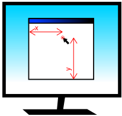

使用鼠标
======================

所有 pyglet 窗口都可以从带有 2 维滚轮的 3 键鼠标接收输入。 
鼠标指针通常由操作系统绘制，但您可以覆盖它并请求不同的光标形状或提供自己的图像或动画。

鼠标事件
-------

所有鼠标事件都由从操作系统接收事件的窗口调度。 
通常，这是鼠标光标所在的窗口，但是鼠标独占性和拖动操作意味着情况并非总是如此。

鼠标指针位置的坐标空间相对于窗口的左下角，增加的 Y 值接近屏幕顶部。
请注意，与许多其他窗口工具包相比，这是“颠倒”的，但与 pyglet 中的默认 OpenGL 投影一致。

    鼠标指针的坐标空间。

最基本的鼠标事件是 :py:meth:`~pyglet.window.Window.on_mouse_motion` ，每次鼠标移动时都会调度它::

    def on_mouse_motion(x, y, dx, dy):
        pass

`x` 和 `y` 参数给出鼠标指针相对于窗口左下角的坐标。

每次操作系统注册鼠标移动时都会调度该事件。 
这不一定是每个移动像素一次——操作系统通常以固定频率对鼠标进行采样，并且很容易移动鼠标的速度比这更快。 
相反，如果您的应用程序处理事件的速度不够快，您可能会发现在单个 :py:meth:`~pyglet.window.Window.dispatch_events` 调用中调度了多个排队的鼠标事件。
没有必要关心这两个问题中的任何一个，后者很少引起问题，前者也避免不了。

许多游戏并不关心鼠标光标的实际位置，只需要知道鼠标向哪个方向移动。 
例如，第一人称游戏中的鼠标通常控制玩家的看向，但不显示鼠标指针本身。

`dx` 和 `dy` 参数用于此目的：它们给出鼠标沿每个轴行进到当前位置的距离。 
这可以通过在每次鼠标事件后存储以前的`x`和`y`参数来天真地计算，但除了编码繁琐之外，它没有考虑其他遮挡窗口的影响。 
最好改用 `dx` 和 `dy` 参数。

按下或释放鼠标按钮或在按住任何按钮时移动鼠标时，窗口调度以下事件::

    def on_mouse_press(x, y, button, modifiers):
        pass

    def on_mouse_release(x, y, button, modifiers):
        pass

    def on_mouse_drag(x, y, dx, dy, buttons, modifiers):
        pass

`x`、 `y` 、 `dx` 和 `dy` 参数与 :py:meth:`~pyglet.window.Window.on_mouse_motion` 事件相同。
按下和释放事件不需要 `dx` 和 `dy`参数，因为在这种情况下它们将为零。 
`modifiers` 参数与键盘事件相同，请参阅 :ref:`guide_working-with-the-keyboard` 。

`button` 参数表示按下了哪个鼠标按钮，并且是以下常量之一::

    pyglet.window.mouse.LEFT
    pyglet.window.mouse.MIDDLE
    pyglet.window.mouse.RIGHT

:py:meth:`~pyglet.window.Window.on_mouse_drag` 中的 `buttons` 参数是当前按住的所有鼠标按钮的按位组合。
例如，测试用户是否正在使用左键执行拖动手势::

    from pyglet.window import mouse

    def on_mouse_drag(x, y, dx, dy, buttons, modifiers):
        if buttons & mouse.LEFT:
            pass

当用户开始拖动操作（即按住鼠标按钮，然后移动鼠标）时，只要按住按钮，他们开始拖动的窗口将继续接收 :py:meth:`~pyglet.window.Window.on_mouse_drag` 事件。
即使鼠标离开窗口也是如此。
您通常不需要特别处理此问题：所有操作系统的惯例是拖动是一种手势，而不是对用户界面小部件的直接操作。

鼠标进入或离开窗口时存在事件::

    def on_mouse_enter(x, y):
        pass

    def on_mouse_leave(x, y):
        pass

:py:meth:`~pyglet.window.Window.on_mouse_leave` 的坐标将位于您的窗外。执行拖动操作时，不会调度这些事件。

鼠标滚轮生成 :py:meth:`~pyglet.window.Window.on_mouse_scroll` 事件::

    def on_mouse_scroll(x, y, scroll_x, scroll_y):
        pass

`scroll_y` 参数给出滚轮移动的“点击”次数，正数表示滚轮向前推。 
大多数鼠标的 `scroll_x` 参数为 0，但是一些新鼠标（如苹果超强滑鼠）使用球而不是轮子，在这种情况下， `scroll_x` 参数给出了水平移动。 
这些数字的规模尚不清楚，它通常由用户在其操作系统首选项中设置。

更改鼠标光标
-----------

鼠标光标可以设置为操作系统光标之一、自定义映像或完全隐藏。 
对光标的更改将仅适用于您进行更改的窗口。 
要隐藏鼠标光标，请调用 :py:meth:`~pyglet.window.Window.set_mouse_visible`::

    win = pyglet.window.Window()
    win.set_mouse_visible(False)

如果鼠标会遮挡用户正在键入的文本，这可能很有用。
如果要隐藏鼠标光标以在游戏环境中使用，请考虑改为将鼠标设置为独占;请参阅下面的：:ref:`guide_mouse-exclusivity`。

使用 :py:meth:`~pyglet.window.Window.set_mouse_cursor` 更改鼠标光标的外观。
鼠标光标是 :py:class:`~pyglet.window.MouseCursor` 的实例。您可以使用以下命令获取操作系统定义的游标 :py:meth:`~pyglet.window.Window.get_system_mouse_cursor`::

    cursor = win.get_system_mouse_cursor(win.CURSOR_HELP)
    win.set_mouse_cursor(cursor)

下面列出了 pyglet 定义的游标，以及它们在 Windows 和 Mac OS X 上的典型外观。 Linux 上的指针图像依赖于窗口管理器。

    .. list-table::
        :header-rows: 1
        :stub-columns: 1
        :class: images

        * - Constant
          - Windows XP
          - Mac OS X
        * - `CURSOR_DEFAULT`
          - .. image:: img/cursor_win_default.png
          - .. image:: img/cursor_mac_default.png
        * - `CURSOR_CROSSHAIR`
          - .. image:: img/cursor_win_crosshair.png
          - .. image:: img/cursor_mac_crosshair.png
        * - `CURSOR_HAND`
          - .. image:: img/cursor_win_hand.png
          - .. image:: img/cursor_mac_hand.png
        * - `CURSOR_HELP`
          - .. image:: img/cursor_win_help.png
          - .. image:: img/cursor_mac_default.png
        * - `CURSOR_NO`
          - .. image:: img/cursor_win_no.png
          - .. image:: img/cursor_mac_no.png
        * - `CURSOR_SIZE`
          - .. image:: img/cursor_win_size.png
          - .. image:: img/cursor_mac_default.png
        * - `CURSOR_SIZE_DOWN`
          - .. image:: img/cursor_win_size_up_down.png
          - .. image:: img/cursor_mac_size_down.png
        * - `CURSOR_SIZE_DOWN_LEFT`
          - .. image:: img/cursor_win_size_nesw.png
          - .. image:: img/cursor_mac_default.png
        * - `CURSOR_SIZE_DOWN_RIGHT`
          - .. image:: img/cursor_win_size_nwse.png
          - .. image:: img/cursor_mac_default.png
        * - `CURSOR_SIZE_LEFT`
          - .. image:: img/cursor_win_size_left_right.png
          - .. image:: img/cursor_mac_size_left.png
        * - `CURSOR_SIZE_LEFT_RIGHT`
          - .. image:: img/cursor_win_size_left_right.png
          - .. image:: img/cursor_mac_size_left_right.png
        * - `CURSOR_SIZE_RIGHT`
          - .. image:: img/cursor_win_size_left_right.png
          - .. image:: img/cursor_mac_size_right.png
        * - `CURSOR_SIZE_UP`
          - .. image:: img/cursor_win_size_up_down.png
          - .. image:: img/cursor_mac_size_up.png
        * - `CURSOR_SIZE_UP_DOWN`
          - .. image:: img/cursor_win_size_up_down.png
          - .. image:: img/cursor_mac_size_up_down.png
        * - `CURSOR_SIZE_UP_LEFT`
          - .. image:: img/cursor_win_size_nwse.png
          - .. image:: img/cursor_mac_default.png
        * - `CURSOR_SIZE_UP_RIGHT`
          - .. image:: img/cursor_win_size_nesw.png
          - .. image:: img/cursor_mac_default.png
        * - `CURSOR_TEXT`
          - .. image:: img/cursor_win_text.png
          - .. image:: img/cursor_mac_text.png
        * - `CURSOR_WAIT`
          - .. image:: img/cursor_win_wait.png
          - .. image:: img/cursor_mac_wait.png
        * - `CURSOR_WAIT_ARROW`
          - .. image:: img/cursor_win_wait_arrow.png
          - .. image:: img/cursor_mac_default.png

或者，您可以使用自己的图像作为鼠标光标。 
使用 :py:func:`pyglet.image.load` 加载图像，然后创建一个包含图像和光标“热点”的 :py:class:`~pyglet.window.ImageMouseCursor` 。 
热点是与屏幕上的实际指针位置相对应的图像点，例如箭头的点::

    image = pyglet.image.load('cursor.png')
    cursor = pyglet.window.ImageMouseCursor(image, 16, 8)
    win.set_mouse_cursor(cursor)

您甚至可以使用 OpenGL 直接渲染鼠标光标。 例如，您可以绘制三维光标或粒子轨迹。 
为此，子类 :py:class:`~pyglet.window.MouseCursor` 并实现您自己的绘制方法。
将使用默认的 pyglet 窗口投影调用 draw 方法，即使您在应用程序的其余部分使用另一个投影也是如此。

.. _guide_mouse-exclusivity:

鼠标独占性
---------

您可以完全控制自己的应用程序的鼠标，防止它被用来激活其他应用程序。
这对于第一人称射击游戏等沉浸式游戏最有用。

启用鼠标独占模式后，鼠标光标将不再可用。
它不仅仅是隐藏的——再多的鼠标移动也不会使它离开您的应用程序。 
由于不再有鼠标光标，因此鼠标事件的“x”和“y”参数毫无意义，您应该仅使用“DX”和“DY”参数来确定鼠标的移动方式。

激活鼠标独占模式 :py:meth:`~pyglet.window.Window.set_exclusive_mouse`::

    win = pyglet.window.Window()
    win.set_exclusive_mouse(True)

即使您的窗口是全屏的，您也应该激活鼠标独占模式：
它将防止窗口“碰到”屏幕边缘，并在多显示器设置中正常运行。
商业全屏游戏的一个常见问题是鼠标只是隐藏的，这意味着它可能会意外地移动到应用程序仍然可见的其他显示器上。

请注意，在 Linux 设置独占鼠标时，还会禁用 Alt+Tab 和其他用于切换应用程序的热键。 尚未发现解决此问题的方法。
