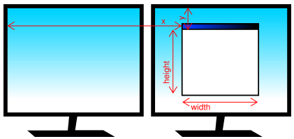

窗口
====

pyglet 中的 :py:class:`~pyglet.window.Window` 对应于操作系统提供的顶级窗口。 
窗口可以是浮动的（与其他应用程序窗口重叠）或全屏。

.. _guide_creating-a-window:

创建窗口
-------

如果在没有参数的情况下调用 :py:class:`~pyglet.window.Window` 构造函数，则将假定所有参数的默认值::

    window = pyglet.window.Window()

使用的默认参数为：

* 窗口的大小为 960x540，并且不可调整大小.
* 将使用中所述的模板配置创建默认上下文 :ref:`guide_glconfig`.
* 窗口标题将是执行 Python 脚本的名称（即 ``sys.argv[0]``）。

窗口在创建后立即可见，除非您向构造函数提供 ``visible=False`` 参数。 
下面的示例演示如何通过两个步骤创建和显示窗口::

    window = pyglet.window.Window(visible=False)
    # ... perform some additional initialisation
    window.set_visible()

OpenGL 上下文配置
^^^^^^^^^^^^^^^^

窗口的上下文一旦创建就无法更改。 有几种方法可以控制创建的上下文：

* 使用 ``context`` 参数创建 :py:class:`~pyglet.gl.Context` ::

      context = config.create_context(share)
      window = pyglet.window.Window(context=context)

* 使用 ``config`` 参数从 :py:class:`~pyglet.gl.Config` 获得完整 :py:class:`~pyglet.canvas.Screen` 。 
  上下文将从此配置创建，并将与最近创建的现有上下文共享对象空间::

      config = screen.get_best_config(template)
      window = pyglet.window.Window(config=config)

* 使用 ``config`` 参数提供模板 :py:class:`~pyglet.gl.Config` 。
  上下文将使用从默认显示的默认屏幕获得的最佳配置::

      config = gl.Config(double_buffer=True)
      window = pyglet.window.Window(config=config)

* 使用 ``screen`` 参数指定 :py:class:`~pyglet.canvas.Screen` 。
  上下文将使用从此屏幕默认模板配置创建的配置::

      screen = display.get_screens()[screen_number]
      window = pyglet.window.Window(screen=screen)

* 使用 ``display`` 参数指定 :py:class:`~pyglet.canvas.Display` 。  
  此显示的默认屏幕将用于使用默认模板配置获取上下文::

      display = platform.get_display(display_name)
      window = pyglet.window.Window(display=display)

如果给出模板 :py:class:`~pyglet.gl.Config` ，则还可以指定 :py:class:`~pyglet.canvas.Screen` 或 :py:class:`~pyglet.canvas.Display 。
但是，任何其他参数组合都会过度约束配置，并且某些参数将被忽略。

全屏窗口
^^^^^^^

如果将 ``fullscreen=True`` 参数提供给窗口构造函数，则窗口将绘制到整个屏幕而不是浮动窗口。 
不会显示任何窗口边框或控件，因此必须确保提供一些其他方法来退出应用程序。

默认情况下，将使用默认显示器上的默认屏幕，但您可以选择指定另一个屏幕来代替。 
例如，以下代码在辅助屏幕上创建一个全屏窗口::

    screens = display.get_screens()
    window = pyglet.window.Window(fullscreen=True, screen=screens[1])

无法创建跨多个窗口的全屏窗口（例如，如果要跨多个监视器创建沉浸式 3D 环境）。 
相反，您应该为每个屏幕创建一个单独的全屏窗口，并将相同的事件处理程序附加到所有窗口。

可以使用 :py:meth:`~pyglet.window.Window.set_fullscreen` 方法切换Windows进入和退出全屏模式。 
例如，从全屏返回到窗口模式::

    window.set_fullscreen(False)

这将会尝试还原以前的窗口大小和位置（如果有），但是操作系统并不总是允许这样做，并且窗口可能已重新定位。

尺寸和位置
---------

本节仅适用于非全屏窗口。 全屏窗口始终具有它们填充的屏幕的宽度和高度。

可以将窗口的大小指定为窗口构造函数的前两个参数。 
在下面的示例中，将创建一个宽度为 1280 像素、高度为 720 像素的窗口::

    window = pyglet.window.Window(1280, 720)

窗口的“大小”是指其中的可绘制空间，不包括操作系统绘制的任何其他边框或标题栏。

可以通过在构造函数中指定 ``resizable=True`` 来允许用户调整窗口大小。 
如果这样做，您可能还需要处理 :py:meth:`~pyglet.window.Window.on_resize` 事件::

    window = pyglet.window.Window(resizable=True)

    @window.event
    def on_resize(width, height):
        print('The window was resized to %dx%d' % (width, height))

您可以使用 :py:meth:`~pyglet.window.Window.set_minimum_size` 和 :py:meth:`~pyglet.window.Window.set_maximum_size` 方法指定窗口大小的最小和最大大小::

    window.set_minimum_size(320, 200)
    window.set_maximum_size(1024, 768)

也可以使用 :py:meth:`~pyglet.window.Window.set_size` 方法以编程方式调整窗口大小（即使窗口不可用户调整大小）::

    window.set_size(1280, 720)

该窗口最初将由操作系统定位。通常，它将使用自己的算法将窗口定位在不阻止其他应用程序窗口或与它们级联的位置。 
您可以使用 :py:meth:`~pyglet.window.Window.get_location`和 :py:meth:`~pyglet.window.Window.set_location` 方法手动调整窗口的位置::

    x, y = window.get_location()
    window.set_location(x + 20, y + 20)

请注意，与 pyglet 中通常的坐标系不同，窗口位置相对于桌面的左上角，如下图所示：

    窗口相对于桌面的位置和大小。

外观
----------

窗口样式
^^^^^^^^^^^^

非全屏窗口可以使用以下四种样式之一创建：默认、对话框、工具或无边框。 下面显示了这些样式在Windows和Mac OS X 10.4下的外观示例。

    .. list-table::
        :header-rows: 1

        * - Style
          - Windows
          - Mac OS X
        * - :py:attr:`~pyglet.window.Window.WINDOW_STYLE_DEFAULT`
          - .. image:: img/window_xp_default.png
          - .. image:: img/window_osx_default.png
        * - :py:attr:`~pyglet.window.Window.WINDOW_STYLE_DIALOG`
          - .. image:: img/window_xp_dialog.png
          - .. image:: img/window_osx_dialog.png
        * - :py:attr:`~pyglet.window.Window.WINDOW_STYLE_TOOL`
          - .. image:: img/window_xp_tool.png
          - .. image:: img/window_osx_tool.png
        * - :py:attr:`~pyglet.window.Window.WINDOW_STYLE_TRANSPARENT`
          - .. image:: img/window_xp_transparent.png
          - <Not Implemented>
        * - :py:attr:`~pyglet.window.Window.WINDOW_STYLE_OVERLAY`
          - .. image:: img/window_xp_overlay.png
          - <Not Implemented>

这些窗口样式的不可调整大小的变体可能略有不同（例如，最大化按钮将被禁用或不存在）。

除了外观更改外，窗口样式还会影响窗口的行为方式。 
例如，工具窗口通常不会出现在任务栏中，并且无法接收键盘焦点、对话框窗口无法最小化、需要自定义大小和相应窗口的移动。
适用于Windows的窗口样式意味着您的应用程序将在其运行的平台上正确运行，但是该行为在Windows，Linux和Mac OS X之间可能不一致。

Linux 中窗口的外观和行为会根据发行版、窗口管理器和用户偏好而有很大差异。

无边框窗口（ :py:attr:`~pyglet.window.Window.WINDOW_STYLE_BORDERLESS` ）根本不由操作系统修饰，并且无法调整大小或在桌面上移动。 
这些对于实现初始屏幕或自定义窗口边框非常有用。

您可以在 :py:class:`~pyglet.window.Window` 构造函数中指定窗口的样式。
创建后，无法更改窗口样式::

    window = pyglet.window.Window(style=pyglet.window.Window.WINDOW_STYLE_DIALOG)

标题
^^^^

窗口的标题显示在其标题栏和任务栏图标中（在 Windows 和某些 Linux 窗口管理器上）。 
您可以在窗口创建期间或以后使用 :py:meth:`~pyglet.window.Window.set_caption` 方法设置标题::

    window = pyglet.window.Window(caption='Initial caption')
    window.set_caption('A different caption')

图标
^^^^

窗口图标显示在 Windows 和 Linux 上的标题栏和任务栏图标中，以及 Mac OS X 上的停靠图标中。 对话框和工具窗口不一定显示其图标。

Windows，Mac OS X和Linux窗口管理器都有自己的首选icon大小:

    Windows XP
        * 标题栏和任务栏的 16x16 图标.
        * Alt+Tab 切换器的 32x32 图标.
    Mac OS X
        * 分辨率 16x16、24x24、32x32、48x48、72x72 和 128x128 的任意数量的图标。 
          显示的实际图像将从提供的图像中插值到正确的大小。
    Linux
        * 没有限制，但是大多数窗口管理器将以与Windows XP相同的方式使用16x16和32x32图标。

:py:meth:`~pyglet.window.Window.set_icon` 方法允许您将任意数量的图像设置为图标。
Pyglet 将选择最合适的使用并将它们应用于窗口。 
如果需要但未提供备用大小，pyglet 将使用简单的插值算法将图像缩放到正确的大小。

以下示例提供 16x16 和 32x32 图像作为窗口图标::

    window = pyglet.window.Window()
    icon1 = pyglet.image.load('16x16.png')
    icon2 = pyglet.image.load('32x32.png')
    window.set_icon(icon1, icon2)

您可以使用 pyglet 支持的任何格式的图像，但建议使用 Alpha 透明度的格式，例如 PNG。
Windows .ico文件仅在 Windows 上受支持，因此不鼓励使用它们。
根本不支持 Mac OS X .icons 文件。

请注意，在运行时设置的图标不需要与应用程序图标有任何关系，应用程序图标必须在应用程序二进制文件中专门编码（请参阅 `自包含可执行文件` ）。

能见度
----------

窗口具有多种可见性状态。 已经显示的是 :py:attr:`~pyglet.window.Window.visible` 属性，它显示或隐藏窗口。

Windows可以最小化，这相当于隐藏它们，只是它们仍然出现在任务栏上（或者在OS X上最小化到扩展坞）。
用户可以通过单击标题栏中的相应按钮来最小化窗口。

您还可以使用 :py:class:`~pyglet.window.Window.minimize` 方法以编程方式最小化窗口。
还有一个相应的 :py:class:`~pyglet.window.Window.maximize`方法。

当窗口可见时， :py:meth:`~pyglet.window.Window.on_show`事件已触发。 
当它被隐藏时，将触发 :py:meth:`~pyglet.window.Window.on_hide` 事件。

在 Windows 和 Linux 上，仅当您手动更改窗口的可见性或最小化或还原窗口时，才会发生这些事件。 
在 Mac OS X 上，用户还可以使用 Command+H 快捷键隐藏或显示窗口（影响可见性）。

.. _guide_subclassing-window:

子类化窗口
------------------

pyglet 中一个有用的模式是针对要显示的每种类型的窗口进行子类 :py:class:`~pyglet.window.Window` ，或者作为主应用程序类。 有几个好处：

* 您可以从构造函数加载字体和其他资源，确保已创建 OpenGL 上下文。
* 只需在类上定义事件处理程序即可添加事件处理程序。 
  创建窗口后，将立即调用 :py:meth:`~pyglet.window.Window.on_resize` 事件
  （这通常不会发生，因为必须先创建窗口，然后才能附加事件处理程序）。
* 减少了对全局变量的需求，因为您可以在窗口上维护应用程序状态。

以下示例显示了与 :ref:`quickstart` 中所示的相同的“Hello World”应用程序，使用子类 :py:class:`~pyglet.window.Window`::

    class HelloWorldWindow(pyglet.window.Window):
        def __init__(self):
            super().__init__()

            self.label = pyglet.text.Label('Hello, world!')

        def on_draw(self):
            self.clear()
            self.label.draw()

    if __name__ == '__main__':
        window = HelloWorldWindow()
        pyglet.app.run()

此示例程序位于
``examples/programming_guide/window_subclass.py``.

Windows 和 OpenGL 上下文
-----------------------

pyglet 中的每个窗口都有一个关联的 OpenGL 上下文。
指定此上下文的配置已在 :ref:`guide_creating-a-window` 中介绍。
绘制到 OpenGL 上下文中是绘制到窗口工作区的唯一方法。

双缓冲
^^^^^^

如果窗口是双缓冲的（即，指定的配置 ``double_buffer=True`` ，默认值），OpenGL 命令将应用于隐藏的后台缓冲区。
可以使用“翻转”方法将这个后台缓冲区带到前面。然后，上一个前缓冲区成为我们在下一帧中渲染到的隐藏后台缓冲区。
如果您使用的是标准的 `pyglet.app.run` 或 :py:class:`pyglet.app.EventLoop` 事件循环，则在每个 :py:meth:`~pyglet.window.Window.on_draw` 事件后会自动处理。

如果窗口不是双缓冲的，则不需要 :py:meth:`~pyglet.window.Window.flip` 操作，您应该记住只调用 :py:func:`pyglet.gl.glFlush` 以确保执行缓冲命令。

垂直回溯同步
^^^^^^^^^^^

双缓冲消除了闪烁的一个原因：用户无法看到绘制的图像，只能看到最终渲染。 但是，它确实引入了另一种称为“撕裂”的闪烁源。

在动画中显示快速移动的对象时，撕裂变得明显。
当视频显示仍在从帧缓冲区读取数据时，会发生缓冲区翻转，导致显示器的上半部分显示上一帧，而下半部分显示更新的帧。 
如果您更新帧缓冲的速度特别快，您可能会注意到显示屏中有三个或更多这样的“撕裂”。

Pyglet 提供了一种通过将缓冲区翻转同步到视频刷新率来避免撕裂的方法。 
默认情况下启用此功能，但可以随时使用 :py:attr:`~pyglet.window.Window.vsync` （垂直跟踪同步）属性手动设置或取消设置。 
在以下示例中最初禁用了 vsync 的情况下创建了一个窗口::

    window = pyglet.window.Window(vsync=False)

通常希望使垂直同步保持启用状态，因为这会导致无闪烁的动画。 在某些用例中，您可能希望禁用它，例如：

* 分析应用程序。测量执行操作所花费的时间将受到等待视频设备刷新所花费的时间的影响，这可能会引发结果。 
  如果要测量应用程序的性能，则应禁用垂直同步。
* 如果您负担不起应用程序被阻止的费用。 例如，如果应用程序运行循环需要快速轮询硬件设备，则可能需要避免使用 vsync 进行阻塞。
